<div align="center">

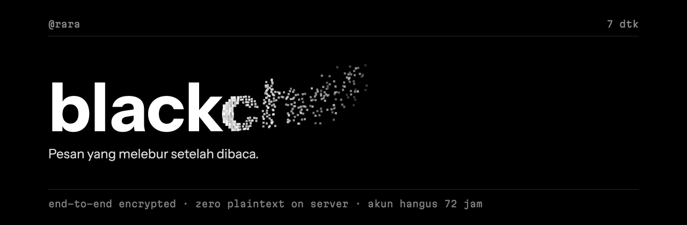

<h3>Chat rahasia satu-lawan-satu. Pesan melebur setelah dibaca. Akun hangus dalam 3 hari.</h3>

<p>
  <a href="https://github.com/MrPrinceAli/blackchat/actions/workflows/ci.yml"></a>
  <a href="LICENSE"></a>
  
  
  <a href="docs/acceptance.md"></a>
</p>

<p>
  
  
  
  
  
  
  
</p>

<p>
  <a href="https://blackchat-id.vercel.app"><b>blackchat-id.vercel.app</b></a>
  &nbsp;·&nbsp; <a href="#-tampilan">Tampilan</a>
  &nbsp;·&nbsp; <a href="#-cara-kerja">Cara kerja</a>
  &nbsp;·&nbsp; <a href="SECURITY.md">Keamanan</a>
  &nbsp;·&nbsp; <a href="#-jalankan-lokal">Jalankan lokal</a>
  &nbsp;·&nbsp; <a href="docs/DEPLOY.md">Deploy</a>
  &nbsp;·&nbsp; <a href="#-english">English</a>
</p>

</div>

---

## ✦ Kenapa blackchat

Kebanyakan aplikasi chat menyimpan semuanya selamanya. blackchat kebalikannya: **tidak ada yang tersisa**.

|  |  |
|---|---|
| 🔐 **End-to-end encrypted** | Kunci dibuat dan disimpan di browser. Server hanya pernah melihat ciphertext: teks, gambar, kontak, bahkan header percakapan. |
| 🔥 **Melebur setelah dibaca** | Timer 3/5/7/10 detik baru mulai saat pesan **benar-benar terlihat** di layar penerima, lalu pesan hancur jadi partikel. Pesan yang menumpuk melebur satu per satu. |
| ⏳ **Akun hangus 72 jam** | Daftar cukup username + password. Tanpa email, tanpa nomor HP, tanpa pemulihan. Setelah 3 hari akun dan semua datanya dihapus. |
| 🕶️ **Server buta relasi** | Server tidak menyimpan siapa bicara dengan siapa, tidak menyimpan IP, tidak tahu jenis pesan. Nama room diturunkan dari rahasia Diffie-Hellman. |
| 🖼️ **Gambar tanpa jejak** | EXIF & GPS dibuang, gambar digambar ulang di canvas, dipotong menjadi chunk berukuran identik sebelum dienkripsi. |
| ✅ **Safety number + QR** | Verifikasi kunci lawan bicara; peringatan otomatis jika username dipakai orang lain dengan kunci berbeda. |
| ↩️ **Batalkan & sepakati timer** | Tarik pesan dari kedua sisi dan server. Perubahan timer hanya berlaku jika kedua pihak setuju. |
| 💸 **Gratis dioperasikan** | Vercel (web statis) + Cloudflare Workers, Durable Objects, D1 (relay). |

## ✦ Tampilan

<table>
  <tr>
    <td align="center" width="25%">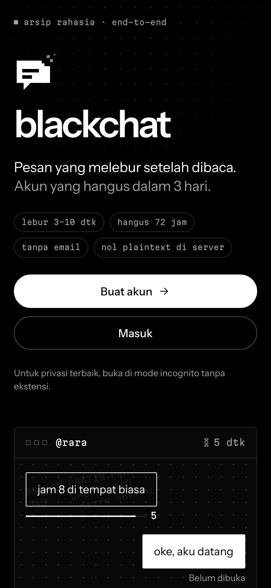<br /><sub><b>Layar awal</b></sub></td>
    <td align="center" width="25%">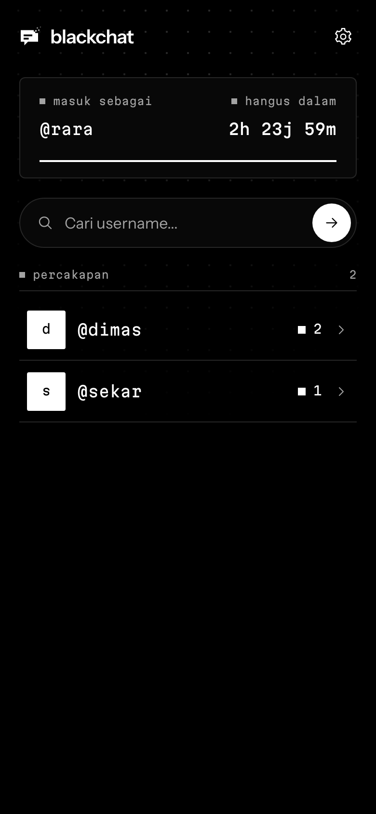<br /><sub><b>Percakapan &amp; umur akun</b></sub></td>
    <td align="center" width="25%">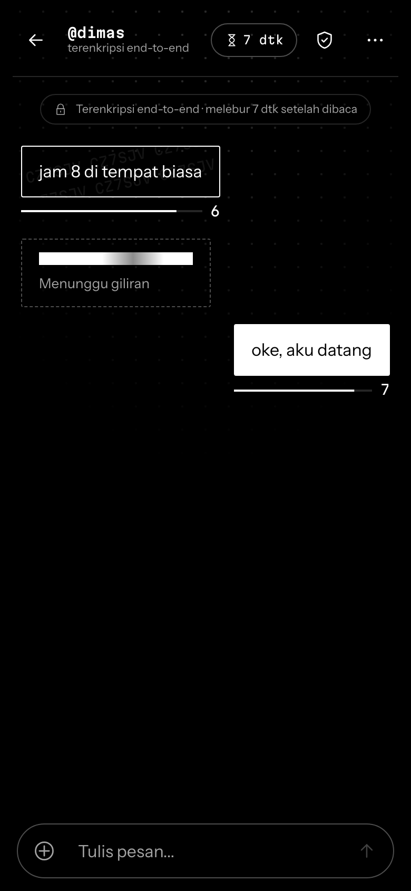<br /><sub><b>Timer mulai saat terlihat</b></sub></td>
    <td align="center" width="25%">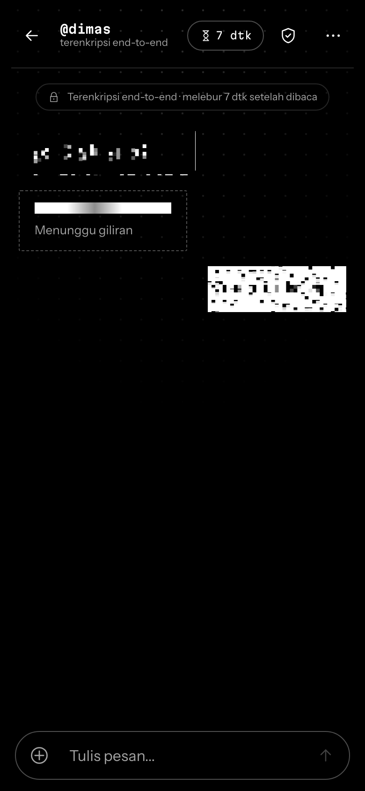<br /><sub><b>Pesan melebur</b></sub></td>
  </tr>
  <tr>
    <td align="center">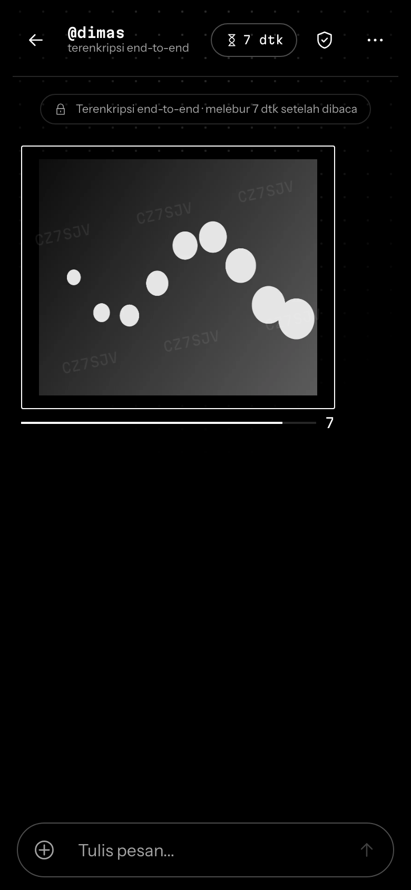<br /><sub><b>Gambar terenkripsi</b></sub></td>
    <td align="center">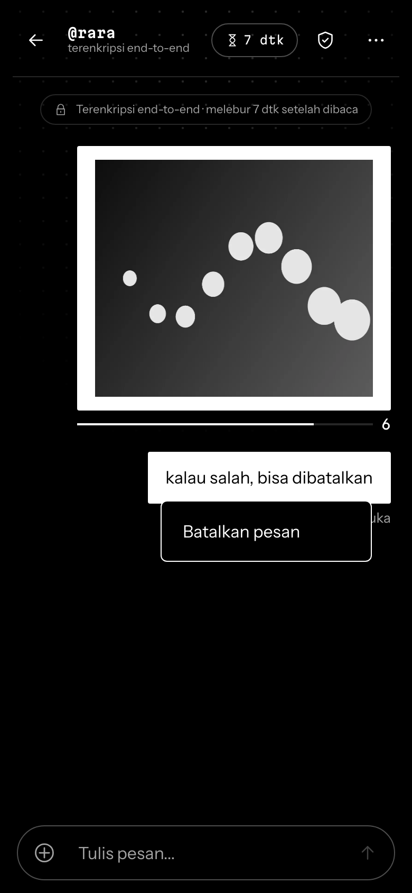<br /><sub><b>Batalkan pesan</b></sub></td>
    <td align="center">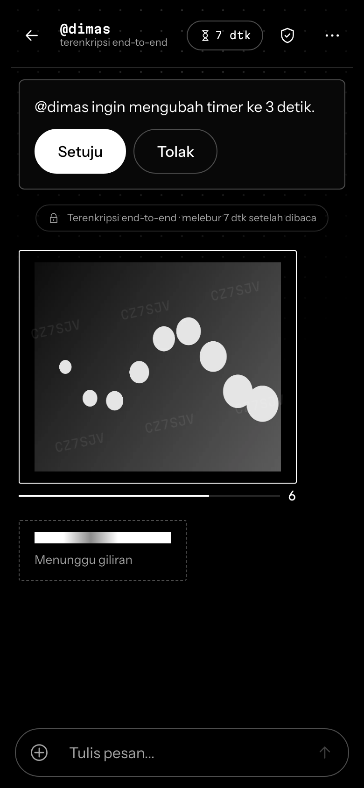<br /><sub><b>Timer disepakati berdua</b></sub></td>
    <td align="center">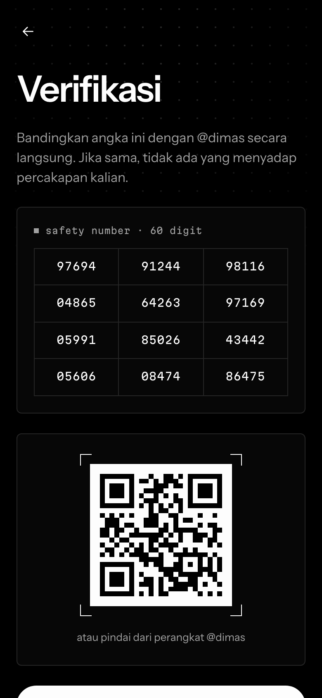<br /><sub><b>Safety number + QR</b></sub></td>
  </tr>
</table>

<table>
  <tr>
    <td align="center" colspan="2">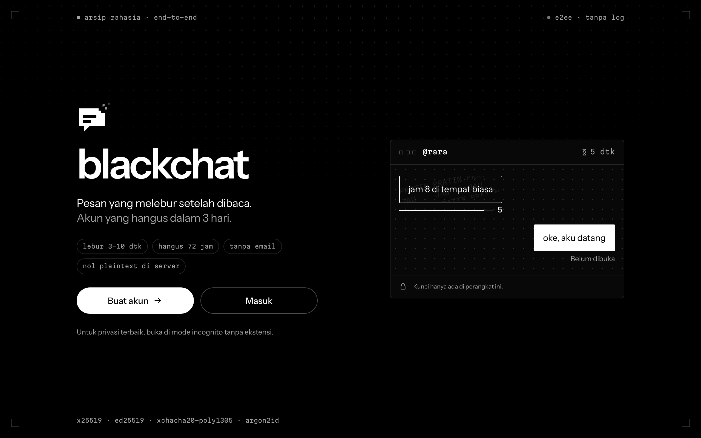<br /><sub><b>Desktop: pratinjau lebur langsung di halaman depan</b></sub></td>
  </tr>
  <tr>
    <td align="center" width="50%">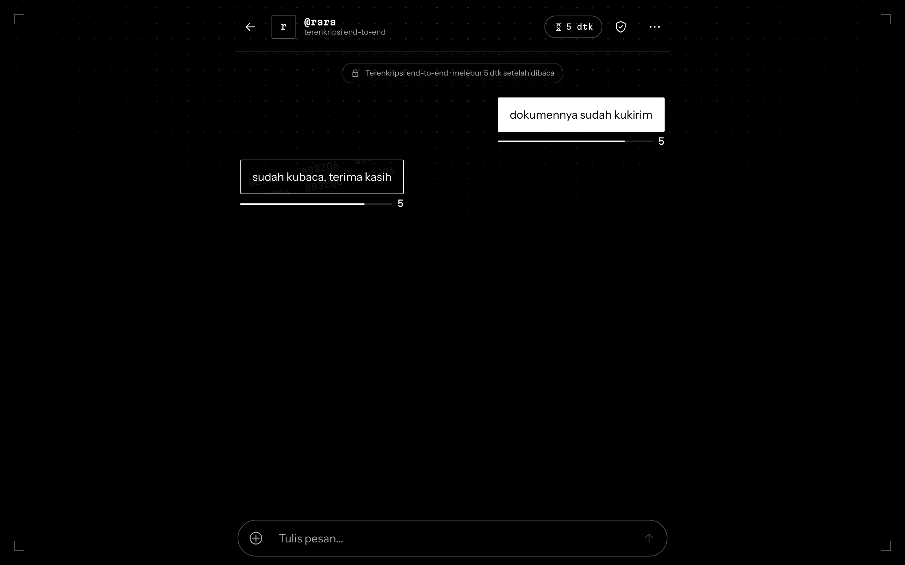<br /><sub><b>Chat desktop: kedua pesan menghitung mundur</b></sub></td>
    <td align="center" width="50%">
      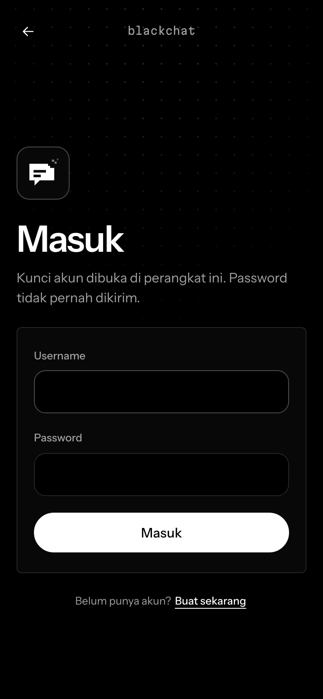
      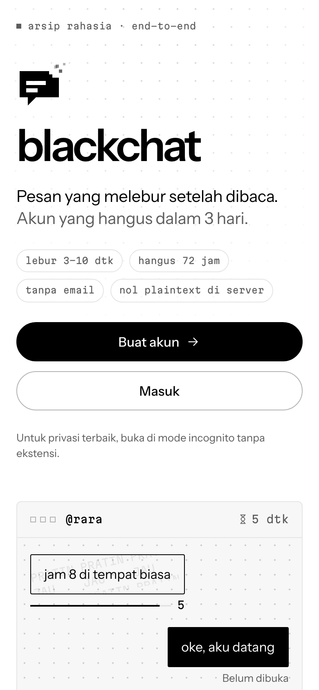<br />
      <sub><b>Halaman masuk · tema terang otomatis</b></sub>
    </td>
  </tr>
</table>

<sub>Monokrom murni: grid titik ala arsip, crop marks, kaca buram, logo gelembung berpiksel yang ikut "melebur". Watermark samar di setiap pesan, layar dihitamkan saat jendela kehilangan fokus. Gambar dibuat ulang dengan <code>pnpm readme:assets</code>.</sub>

## ✦ Cara kerja

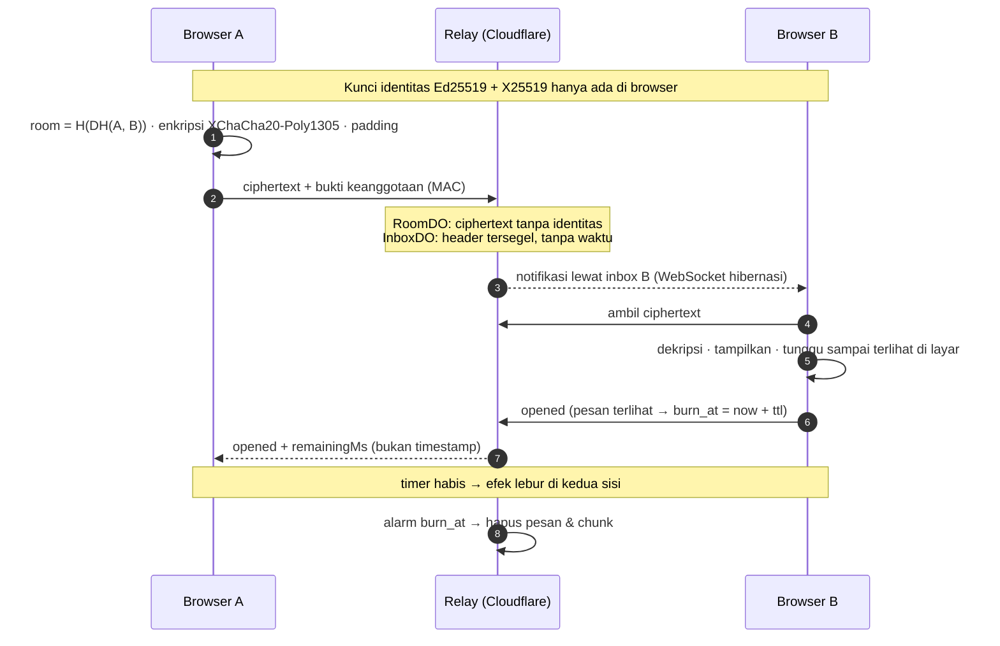

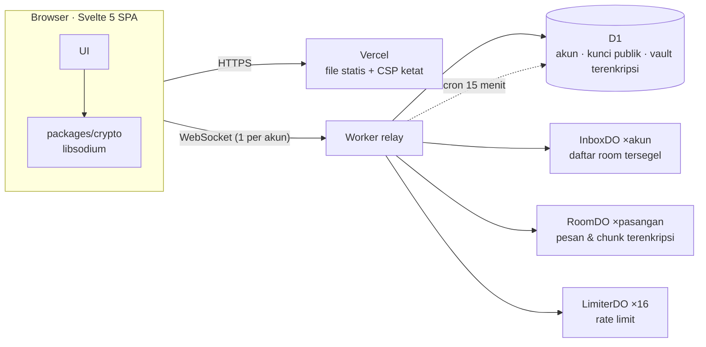

| Lapisan | Pilihan |
|---|---|
| Kunci akun | Argon2id (64 MiB, t=3) dari password → membuka vault berisi kunci rahasia; server hanya menyimpan SHA-256 dari `authKey` |
| Pesan | XChaCha20-Poly1305, teks di-pad ke kelipatan 256 B, chunk gambar identik (256 KB) |
| Metadata | ID room berbeda per inbox, header percakapan selalu 560 B, `expiresAt` publik dibulatkan ke jam |
| Browser | CSP `script-src 'self'` tanpa inline, tanpa `innerHTML`/`{@html}`/`eval` (ditegakkan lint), kunci sesi non-extractable, kunci otomatis 10 menit |

Model ancaman lengkap (37 risiko, status & mitigasinya) dan batasan yang diterima ada di **[SECURITY.md](SECURITY.md)**.

## ✦ Diuji, bukan sekadar diklaim

| | Jumlah | Di mana |
|---|---|---|
| Unit & integrasi | **899** test | protocol (validator & encoding), crypto (vektor silang libsodium ↔ noble), relay di **workerd** sungguhan dengan D1 & Durable Objects lokal, web (termasuk Chromium sungguhan untuk canvas & EXIF) |
| End-to-end | **29** skenario × 2 viewport | Playwright terhadap relay lokal + build produksi dengan **CSP produksi**: 320×568 dan 1280×800 |
| Kriteria penerimaan | **32/32** | Setiap butir PRD §15.2 dipetakan ke test-nya di [docs/acceptance.md](docs/acceptance.md) |
| Uji mutasi | manual | Pemeriksaan keamanan utama dihapus satu per satu untuk membuktikan test-nya gagal |

Setiap E2E juga memeriksa: tidak ada request keluar origin, tidak ada pelanggaran CSP, tidak ada error konsol, tidak ada scroll horizontal.

## ✦ Jalankan lokal

Prasyarat: Node 22 (`.nvmrc`) dan pnpm 9 lewat corepack.

```bash
corepack enable
pnpm install
cp apps/relay/.dev.vars.example apps/relay/.dev.vars   # isi SALT_SECRET: openssl rand -hex 32
pnpm dev                                               # relay :8787 (D1 & DO lokal) + web :5173
```

<details>
<summary><b>Semua perintah</b></summary>

| Perintah | Isi |
|---|---|
| `pnpm lint` | ESLint + bukti bahwa aturan PRD §12 aktif |
| `pnpm format:check` | Prettier |
| `pnpm typecheck` | TypeScript strict seluruh paket + e2e |
| `pnpm test` | Unit protocol/crypto/web, test relay di workerd, test browser (Chromium), test tooling |
| `pnpm build` | Build web + bundle relay produksi |
| `pnpm check:inline` | HTML build tanpa script/style inline (CSP) |
| `pnpm --filter @blackchat/relay check:bundle` | Bundle relay produksi bebas kode test |
| `pnpm test:e2e` | Playwright: relay lokal tersendiri + build produksi dengan CSP produksi |
| `pnpm readme:assets` | Buat ulang banner, social preview, dan screenshot README |
| `pnpm configure-domains --web … --relay …` | Isi domain produksi ke CSP & `ALLOWED_ORIGIN` |

Pertama kali: `pnpm exec playwright install chromium`. WebKit opsional: `E2E_WEBKIT=1 pnpm test:e2e`.

</details>

<details>
<summary><b>Struktur repo</b></summary>

```
apps/web           Vite + Svelte 5 SPA (UI, kriptografi client)
apps/relay         Cloudflare Worker + Durable Objects + D1
packages/protocol  Tipe, konstanta, validator, encoding (dipakai web & relay)
packages/crypto    Semua operasi kriptografi client (libsodium)
e2e/               Test end-to-end Playwright (relay lokal sungguhan)
tooling/           Pemeriksa aturan lint, CSP, bundle relay; konfigurasi domain; gambar README
docs/              Rencana gelombang, keputusan (D-001…), progres, kriteria penerimaan, deploy
```

Dokumen acuan: [BLACKCHAT_PRD.md](BLACKCHAT_PRD.md) (spesifikasi) dan [docs/DECISIONS.md](docs/DECISIONS.md) (koreksi & keputusan; menang jika bertentangan dengan PRD). Proyek dibangun dalam 13 gelombang (W0–W12): [docs/BLACKCHAT-WAVES.md](docs/BLACKCHAT-WAVES.md), [docs/PROGRESS.md](docs/PROGRESS.md).

</details>

## ✦ Deploy

Web di **Vercel** (`blackchat-id.vercel.app`), relay di **Cloudflare Workers**. Panduan langkah demi langkah: **[docs/DEPLOY.md](docs/DEPLOY.md)**.

## ✦ Dependensi

Sengaja minimal. Semua versi dipin persis (`.npmrc` `save-exact=true`); dependensi baru wajib ditambahkan ke tabel ini beserta alasannya (PRD §12 aturan 14).

| Runtime | Dipakai di | Alasan |
|---|---|---|
| `libsodium-wrappers-sumo` | packages/crypto | Semua primitif kripto client. Varian sumo dibutuhkan untuk Argon2id (PRD §2.3). Membawa tipe TypeScript sendiri |
| `@noble/hashes` | apps/relay | BLAKE2b di relay (D-007): WebCrypto tidak punya BLAKE2b, libsodium tidak bisa dimuat di Workers. Diaudit, pure JS |
| `svelte` | apps/web | Framework UI, output statis tanpa inline script (CSP ketat) |
| `qrcode-generator` | apps/web | QR safety number (PRD §4.4). MIT, tanpa dependensi; modul QR digambar sendiri ke canvas (tanpa HTML/SVG string) |

<details>
<summary><b>Dependensi pengembangan</b></summary>

| Paket | Alasan |
|---|---|
| `typescript` | Typecheck strict seluruh monorepo |
| `vite`, `@sveltejs/vite-plugin-svelte`, `svelte-check` | Build dan typecheck SPA |
| `@noble/hashes` | Test packages/crypto: pemeriksaan silang Argon2id & BLAKE2b dengan implementasi independen |
| `@types/node` | Tipe Node khusus untuk file test (kode `src` tidak boleh memakai API Node) |
| `vitest` | Test unit semua paket. Dipin di 4.x karena `@cloudflare/vitest-pool-workers` membutuhkan vitest 4 |
| `wrangler`, `@cloudflare/workers-types` | Dev lokal, build, dan deploy relay |
| `@cloudflare/vitest-pool-workers` | Test relay di dalam runtime Workers (workerd) dengan D1 dan Durable Objects lokal |
| `eslint`, `@eslint/js`, `typescript-eslint`, `eslint-plugin-svelte`, `svelte-eslint-parser`, `globals` | Lint dengan aturan wajib PRD §12 |
| `prettier`, `prettier-plugin-svelte` | Format kode konsisten |
| `@playwright/test` | Smoke & E2E di browser sungguhan, dengan CSP produksi (`e2e/`); juga gambar README (`tooling/readme-assets/`) |
| `@vitest/browser-playwright`, `playwright` | Test unit yang butuh browser sungguhan (canvas, encoder gambar): `*.browser.test.ts` di apps/web |

</details>

## ✦ Kontribusi & keamanan

- Temukan celah keamanan? **Jangan buka issue publik.** Laporkan lewat GitHub → Security → *Report a vulnerability* ([SECURITY.md](SECURITY.md)).
- Ingin berkontribusi? Baca [CONTRIBUTING.md](CONTRIBUTING.md): satu perubahan = satu branch = satu PR, CI wajib hijau.

## ✦ English

<details>
<summary><b>What is blackchat?</b></summary>

**blackchat** is an end-to-end encrypted, ephemeral one-to-one chat for the browser.

- **Sign up with just a username and password.** No email, no phone number, no recovery. Accounts self-destruct after **72 hours**.
- **Messages burn after reading.** A 3/5/7/10-second timer starts only once the message is actually visible on the recipient's screen; then it dissolves into particles on both sides and is deleted from the server.
- **The server is blind.** It only ever stores ciphertext (libsodium: X25519, Ed25519, XChaCha20-Poly1305, Argon2id). It does not store who talks to whom, IP addresses, or message types. Room names are derived from a Diffie-Hellman secret, conversation headers are sealed and fixed-size, and image chunks are identical in size.
- **Images** are re-drawn through a canvas to strip EXIF/GPS before encryption.
- **Safety numbers + QR** for key verification, and a warning when a username is re-registered with a different key.
- **Runs on free tiers:** static SPA on Vercel, relay on Cloudflare Workers + Durable Objects + D1.
- **Tested:** 899 unit/integration tests (including the relay inside workerd), 29 Playwright end-to-end scenarios against the production build with the production CSP, and all 32 acceptance criteria mapped to tests.

The UI is in Indonesian. The threat model is in [SECURITY.md](SECURITY.md); deployment is in [docs/DEPLOY.md](docs/DEPLOY.md).

</details>

## ✦ Lisensi & atribusi

[MIT](LICENSE).

- Font Instrument Sans dan Martian Mono (SIL Open Font License 1.1), subset Latin dari [Fontsource](https://fontsource.org). Lisensi di `apps/web/public/fonts/`.
- Daftar password umum di `packages/crypto/src/common-passwords.ts` diturunkan dari [SecLists](https://github.com/danielmiessler/SecLists) (MIT, © Daniel Miessler). Lihat D-010.

<div align="center">
<br />
<sub>Tidak ada yang tersimpan. Tidak ada yang tersisa. 🖤</sub>
</div>
